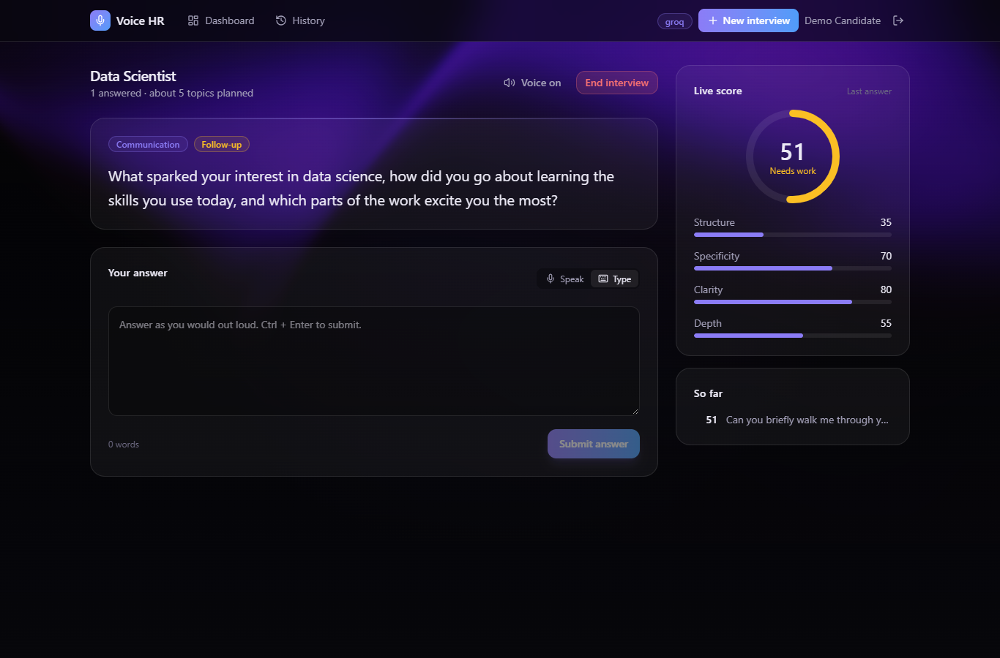
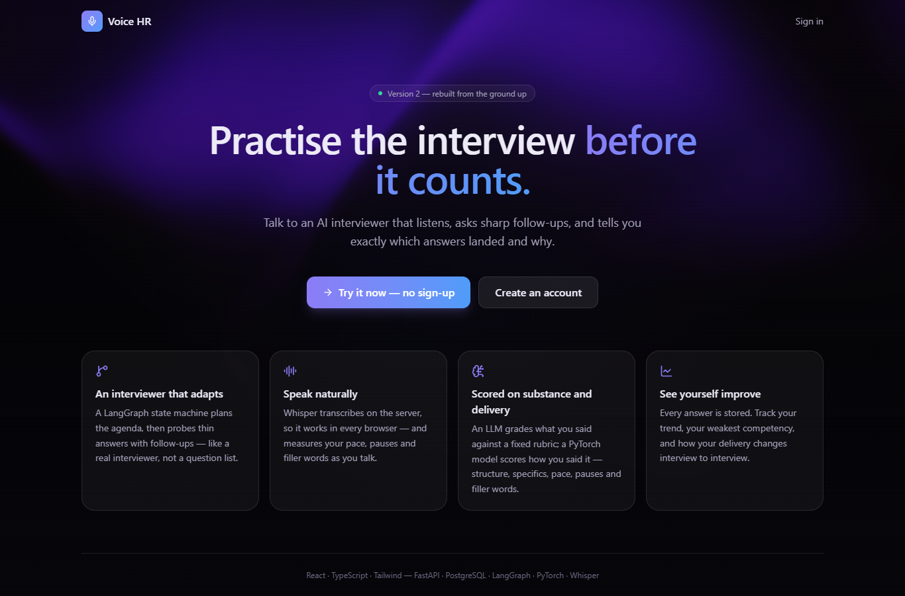
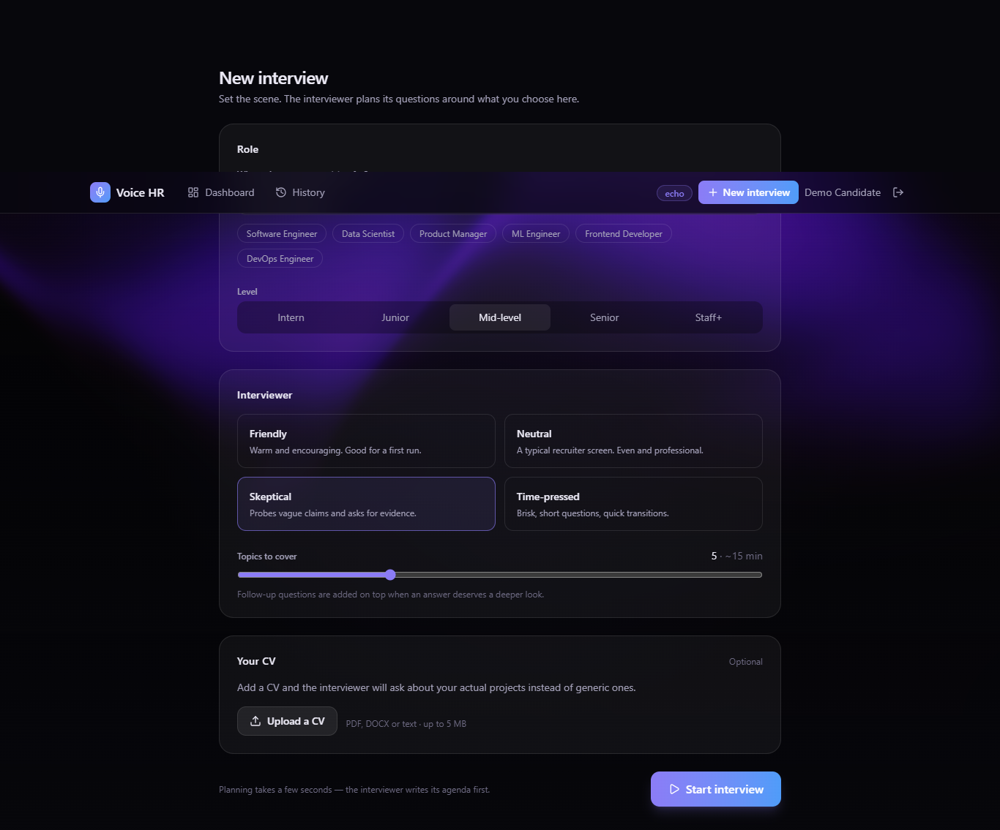
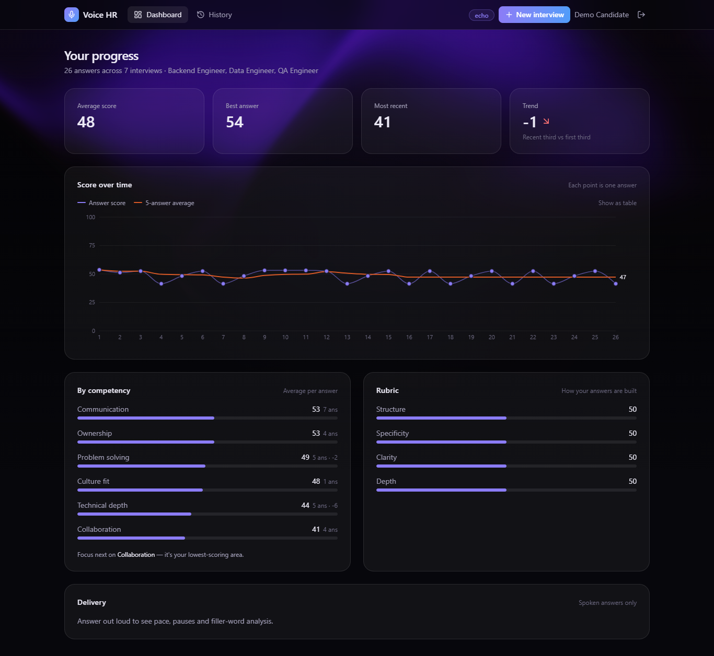
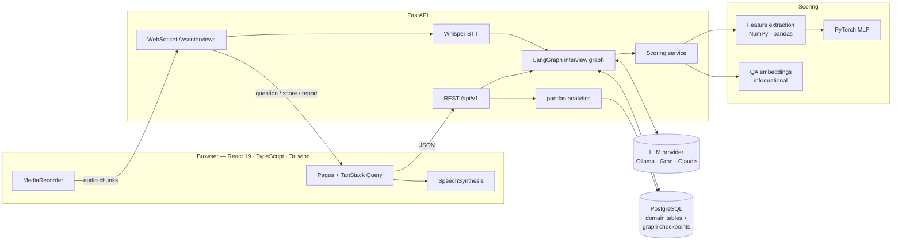
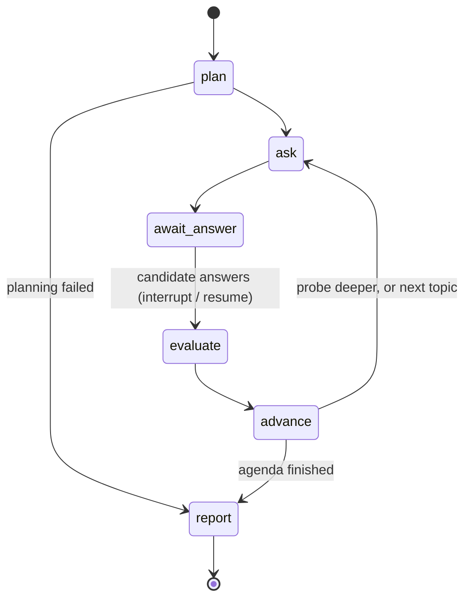

<h1 align="center">🎙️ Voice HR</h1>

<p align="center">
  <strong>Practise job interviews with an AI interviewer that listens, adapts, and scores every answer.</strong>
</p>

<p align="center">
  
  
  
  
  
  
  
</p>

<p align="center">
  
</p>

You pick a role, a level and an interviewer style. The interviewer plans an
agenda, asks questions out loud, listens to your spoken answers, and follows up
when an answer is thin — the way a real interviewer does. Every answer is scored
by an LLM rubric and a PyTorch delivery model, and at the end you get written
feedback that quotes what you actually said.

---

## What's inside

| | |
|---|---|
| **Adaptive interviewer** | A [LangGraph](https://github.com/langchain-ai/langgraph) state machine plans the interview, asks each question, grades the answer, and decides whether to probe deeper or move on. State is checkpointed to PostgreSQL, so an interview survives a dropped connection or a page reload. |
| **Server-side speech** | Whisper transcribes on the server — locally with [faster-whisper](https://github.com/SYSTRAN/faster-whisper), or via Groq's hosted Whisper in the lean deploy — so voice works in every browser (v1 was Chrome-only). Per-word timings feed pace, pause and hesitation analysis. |
| **Two-model scoring** | An LLM grades each answer against a fixed rubric and a **PyTorch** model scores structure and delivery from engineered features. Embedding similarity is measured too — and deliberately kept out of the score, because calibration showed it can't tell on-topic answers from off-topic ones. |
| **Any LLM** | One `LLMProvider` interface with adapters for **Ollama** (local, GPU, no rate limits), **Groq** (hosted free tier) and **Claude** (highest quality). Switching is one environment variable. |
| **Progress analytics** | **pandas** turns your history into a trend line with a rolling average, per-competency breakdowns, delivery metrics and a percentile against other candidates. |
| **CV-aware questions** | Upload a CV (PDF, DOCX or text) and the interviewer asks about your real projects instead of generic ones. |

## Screenshots

| Landing | Interview setup |
|---|---|
|  |  |



---

## Architecture



### The interview graph



- **plan** — the LLM writes an agenda of topics across competencies, grounded in the CV if there is one. Planning up front keeps the interview balanced; an LLM asked only for "the next question" drifts toward whatever you last mentioned.
- **ask** — uses the planned question for a new topic, or generates a follow-up that reacts to what you just said.
- **await_answer** — a LangGraph `interrupt`. The graph checkpoints and suspends until the answer arrives.
- **evaluate** — rubric grading plus local scoring (below). Sets whether the answer is worth probing.
- **advance** — probe the same topic (at most twice) or move on.
- **report** — written feedback, strengths, improvements and one thing to practise next.

### How an answer is scored

| Signal | What it measures | Source |
|---|---|---|
| **Rubric** | Structure, specificity, clarity, depth — anchored bands from "poor" to "exceptional" | LLM with structured output |
| **Delivery model** | STAR coverage, ownership (*I* vs *we*), concrete numbers, hedging, filler words, and — for spoken answers — pace, long pauses and silence | PyTorch MLP over 24 engineered features |
| **Similarity** *(shown, not scored)* | Question–answer cosine similarity | QA-trained sentence embeddings |

The score is `0.65 × rubric + 0.35 × delivery`. If the LLM call fails, the
PyTorch model carries the score alone, so the interview never stalls.

**Why similarity isn't in the score.** An earlier version multiplied the score
by a relevance factor, assuming low question–answer similarity meant the
candidate had drifted off topic. The first real spoken test disproved that: a
perfectly reasonable answer scored 0.0 similarity and lost two thirds of its
score. [`ml/calibrate_relevance.py`](apps/api/ml/calibrate_relevance.py)
measures three embedding models on on-topic, other-question and unrelated
answers, and in every one the ranges overlap:

| Model | On-topic min | Other-question max | Unrelated max |
|---|---|---|---|
| all-MiniLM-L6-v2 | −0.008 | 0.431 | 0.208 |
| multi-qa-MiniLM-L6-cos-v1 | 0.024 | 0.391 | 0.228 |
| multi-qa-mpnet-base-cos-v1 | 0.023 | 0.396 | 0.209 |

Behavioural questions are generic and answers are specific stories — one good
story answers several questions — so no threshold works. Off-topic answers are
penalised by the rubric instead, whose anchors score them 0–39.

### The PyTorch model, honestly

There is no public dataset of interview answers graded on this rubric, so the
model is bootstrapped on a synthetic corpus with an explicit generative process
(`apps/api/ml/generate_dataset.py`): sample a correlated latent quality vector,
render it into answer text and simulated word timings, then re-extract features
with the production extractor. The model never sees the latent vector, so it
learns a genuine, lossy inverse mapping rather than an identity.

Held-out results on 8,000 rows (`python -m ml.benchmark`):

| Model | Mean R² | Overall R² |
|---|---|---|
| Ridge regression | 0.524 | 0.605 |
| Gradient boosting | 0.536 | 0.615 |
| **Multi-task MLP (shipped)** | **0.548** | **0.634** |

The MLP beats both baselines on every dimension, but only narrowly — and a
wider network overfits without gaining anything. That says the ceiling is the
information in the features, not model capacity. Every scored answer stores its
feature vector next to the LLM's rubric score, so the next step is retraining on
real, LLM-graded answers.

---

## Quick start

### Option 1 — Docker (everything in one command)

```bash
cp .env.example .env          # then set LLM_PROVIDER and a key (see below)
docker compose up --build
```

- App: <http://localhost:5173>
- API docs: <http://localhost:8000/docs>

Fully local with your own GPU and no API key:

```bash
# in .env: LLM_PROVIDER=ollama
docker compose --profile ollama up --build
docker compose exec ollama ollama pull qwen2.5:7b-instruct
```

### Option 2 — Local development

**Prerequisites:** Python 3.12+, Node 22+, Docker (for PostgreSQL).

```bash
# Database
docker run -d --name voicehr-pg -p 5432:5432 \
  -e POSTGRES_USER=voicehr -e POSTGRES_PASSWORD=voicehr_dev_password -e POSTGRES_DB=voicehr \
  postgres:16-alpine

# API
cd apps/api
python -m venv .venv
.venv/Scripts/activate            # Windows   (macOS/Linux: source .venv/bin/activate)
pip install -e ".[ml,dev]"        # [ml] = PyTorch, local Whisper, embeddings
alembic upgrade head
python -m ml.generate_dataset && python -m ml.train_scorer   # ~1 minute on CPU
python -m app                     # http://localhost:8000

# Web (second terminal)
cd apps/web
npm install
npm run dev                       # http://localhost:5173 — proxies /api and /ws
```

> `python -m app` rather than `uvicorn` directly: on Windows it switches asyncio
> to the selector event loop that psycopg's async mode (used by the LangGraph
> checkpointer) requires.

**No LLM handy?** Set `LLM_PROVIDER=echo` to run the whole app offline. You get
canned questions and scores from the local PyTorch model only.

**GPU acceleration:** `pip install -e .` pulls CPU PyTorch. For an NVIDIA GPU,
swap in a CUDA build of the same torch version. RTX 50-series (Blackwell) cards
need CUDA 12.8 or newer; for torch 2.14 that is the CUDA 13.0 build, which needs
NVIDIA driver 580+:

```bash
pip install --force-reinstall --no-deps "torch==2.14.0" --index-url https://download.pytorch.org/whl/cu130
```

Whisper then tries the GPU in `float16`. If CTranslate2 (Whisper's runtime)
can't use it — it ships its own CUDA dependencies, separate from PyTorch's — it
falls back to CPU automatically, on load or on the first transcription.

---

## Configuration

All settings are environment variables (see [`.env.example`](.env.example)).

| Variable | Default | Purpose |
|---|---|---|
| `LLM_PROVIDER` | `ollama` | `ollama`, `groq`, `anthropic`, or `echo` (offline) |
| `ANTHROPIC_API_KEY` | — | Claude ([console.anthropic.com](https://console.anthropic.com/settings/keys)) |
| `ANTHROPIC_MODEL` | `claude-opus-5` | Claude model; `ANTHROPIC_EFFORT` sets reasoning effort |
| `GROQ_API_KEY` | — | Groq free tier ([console.groq.com](https://console.groq.com/keys)) |
| `GROQ_MODEL` | `openai/gpt-oss-120b` | `qwen/qwen3.8-27b` is ~2.5× faster with similar grading |
| `OLLAMA_BASE_URL` / `OLLAMA_MODEL` | `http://localhost:11434` / `qwen2.5:7b-instruct` | Local inference |
| `DATABASE_URL` | built from `POSTGRES_*` | Takes precedence; `postgres://` URLs from Railway/Heroku are handled |
| `JWT_SECRET` | dev value | **Required** in production — startup refuses the default |
| `WHISPER_MODEL` | `base.en` | Any faster-whisper size: `tiny.en` … `large-v3` |
| `SPEECH_ENABLED` / `EMBEDDINGS_ENABLED` | `true` | Turn off to run lighter |

If the configured provider can't be built (missing key or package), the API
falls back through Claude → Groq → Ollama and reports which one is live at
`/api/v1/health/ready`.

---

## Deployment

There are two images, because the full ML runtime and free hosting don't mix.

| | [`Dockerfile`](Dockerfile) (full) | [`deploy/render/Dockerfile`](deploy/render/Dockerfile) (lean) |
|---|---|---|
| Speech-to-text | faster-whisper in the container | Groq's hosted Whisper |
| Scorer inference | PyTorch | NumPy, from exported weights |
| Embeddings | yes | off (they're informational only) |
| Image / RAM | 3.35 GB / ~1.5 GB | 810 MB / **~140 MB peak** |
| Fits | Railway, Cloud Run, a VM | **Render's free tier (512 MB)** |

The lean image still uses PyTorch: a build stage trains the scorer and exports
its weights to a 36 KB `.npz`, and only that ships. The NumPy forward pass
matches the PyTorch one to four decimal places (`tests/unit/test_numpy_model.py`),
and CI runs the whole test suite in a PyTorch-free install to keep that path honest.
Groq's Whisper returns the same per-word timings as local Whisper, so the pace
and pause features are identical.

**Render (free)** — with a [Neon](https://neon.tech) database (region AWS US
East, connection pooling off) and a [Groq](https://console.groq.com/keys) key:

```bash
RENDER_API_KEY=... DATABASE_URL=... GROQ_API_KEY=... python deploy/render/deploy.py
```

That creates the service in Render's Virginia region (next to Neon's us-east-1),
sets its environment, generates `JWT_SECRET`, deploys and waits until it's live.
After that, [deploy-render.yml](.github/workflows/deploy-render.yml) redeploys
after every green CI run on `main`, once the repo has a `RENDER_API_KEY` secret
and `RENDER_DEPLOY=true` variable. Prefer clicking? [`render.yaml`](render.yaml)
is a Blueprint: New → Blueprint → this repo.

Free-tier services sleep after 15 minutes idle; the first visit after that takes
about a minute to wake. Hosted Postgres URLs work as-is — `sslmode` and other
libpq options are translated for asyncpg automatically.

**Full image elsewhere** — [`railway.json`](railway.json) configures Railway, and
[`deploy/huggingface/deploy.py`](deploy/huggingface/deploy.py) deploys to a
Hugging Face Docker Space (Docker Spaces now require HF PRO).

The landing page has a one-click demo account, so visitors can try it without
signing up.

---

## Testing and CI

```bash
cd apps/api && pytest            # 76 tests: graph, scoring, speech, config, analytics, HTTP lifecycle
cd apps/web && npm test          # session reducer, formatting, components
```

The API suite runs the real compiled LangGraph, routers and services against
SQLite and a deterministic in-process LLM, so it needs no network or GPU. It
includes a regression test for enum values that come back as plain strings
after a PostgreSQL checkpoint round-trip.

[GitHub Actions](.github/workflows/ci.yml) runs on every push and pull request:

- **API (lean):** the test suite in an install without PyTorch, as deployed.
- **API:** ruff, mypy, a migration round-trip on a real PostgreSQL service
  (`upgrade → downgrade → upgrade → alembic check`), pytest with coverage, and a
  smoke run of the ML pipeline (generate → train → load checkpoint).
- **Web:** ESLint, TypeScript, Vitest, production build.
- **Images:** builds both the full and the lean deploy images on pushes to `main`.

---

## Project structure

```
apps/
├── api/                      FastAPI service
│   ├── app/
│   │   ├── graph/            LangGraph state, nodes, contracts, builder
│   │   ├── llm/              Provider protocol + Ollama / Groq / Claude / echo adapters
│   │   ├── scoring/          Feature extraction, PyTorch model, embeddings, blending
│   │   ├── speech/           Whisper transcription
│   │   ├── analytics/        pandas aggregation for the dashboard
│   │   ├── models/           SQLAlchemy 2.0 ORM
│   │   ├── schemas/          Pydantic request/response models
│   │   ├── routers/          REST + WebSocket endpoints
│   │   └── services/         Glue between graph, database and storage
│   ├── alembic/              Migrations
│   ├── ml/                   Dataset generation, training, benchmark
│   └── tests/
└── web/                      React 19 + TypeScript + Tailwind v4
    └── src/
        ├── api/              Typed client and TanStack Query hooks
        ├── features/         Auth context, interview session reducer
        ├── hooks/            Recorder, speech synthesis, interview WebSocket
        ├── components/       UI kit, charts, animated background
        └── pages/
Dockerfile                    Single-container deploy image
docker-compose.yml            Local full stack (+ optional GPU Ollama)
```

## What changed from v1

v1 was a Django app with a single endpoint that forwarded messages to Gemini.
Its conversation history lived in a module-level global, so every user on the
server shared one interview; nothing was saved; voice only worked in Chrome; and
there were no tests. v2 is a rewrite: typed end to end, persistent, testable,
provider-agnostic, and it actually evaluates answers instead of only chatting.

## License

MIT
