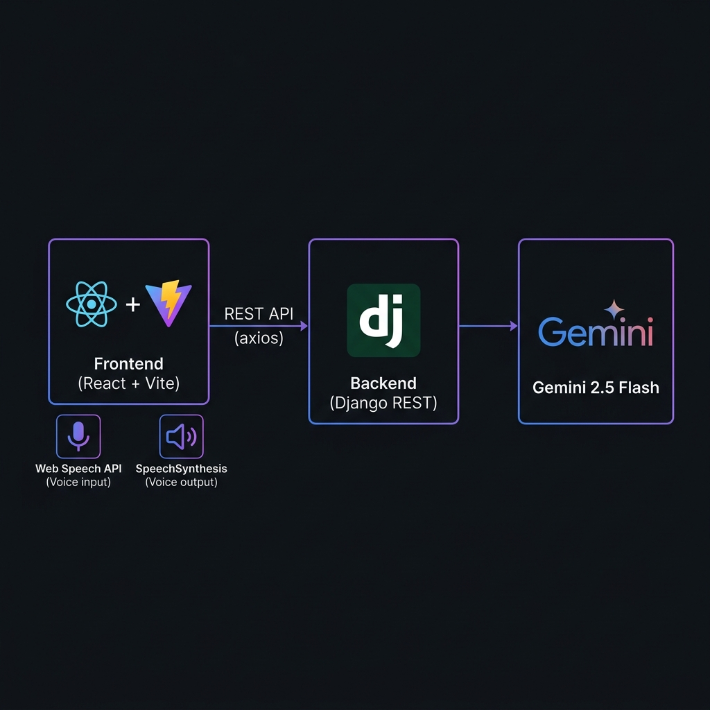

<h1 align="center">🎙️ Voice HR Bot</h1>

<p align="center">
  <strong>An AI-powered HR interview simulator with real-time voice interaction</strong>
</p>

<p align="center">
  <a href="#features"></a>
  <a href="#tech-stack"></a>
  <a href="#tech-stack"></a>
  <a href="#tech-stack"></a>
  <a href="LICENSE"></a>
</p>

<p align="center">
  Practice job interviews with an AI interviewer that <em>listens</em> to your voice, asks role-specific questions, and <em>speaks</em> responses back to you — all in a stunning glassmorphic UI with animated shader backgrounds.
</p>


## ✨ Features

| Feature | Description |
|---------|-------------|
| 🎤 **Voice Input** | Speak your answers using the Web Speech API — no typing required |
| 🔊 **Voice Output** | AI responses are spoken aloud via SpeechSynthesis for a realistic interview feel |
| 🤖 **Gemini 2.5 Flash** | Powered by Google's latest AI model for intelligent, context-aware interview questions |
| 💬 **Conversational Memory** | The AI remembers the full conversation context for follow-up questions |
| 🎯 **Role-Specific** | Practice for any role — Data Scientist, Software Engineer, Product Manager, etc. |
| 🎨 **Glassmorphic UI** | Stunning frosted-glass design with animated WebGL shader backgrounds (OGL) |
| 🎙️ **Mic Selection** | Choose your preferred microphone from available audio input devices |
| 📱 **Responsive** | Fully responsive design that works on desktop and mobile browsers |
| ⚡ **Real-time** | Instant voice recognition and AI response with minimal latency |

---

## 🏗️ Architecture

<p align="center">
  
</p>

```
┌─────────────────────────────────────────────────────────────────┐
│                        FRONTEND (React + Vite)                  │
│                                                                 │
│  ┌──────────────┐   ┌──────────────┐   ┌─────────────────────┐ │
│  │  Web Speech   │   │  OGL Shader  │   │   React UI          │ │
│  │  Recognition  │   │  Background  │   │   (Glassmorphism)   │ │
│  └──────┬───────┘   └──────────────┘   └──────────┬──────────┘ │
│         │                                          │            │
│         ▼                                          ▼            │
│  ┌──────────────┐                       ┌─────────────────────┐ │
│  │  Speech       │                       │  Axios HTTP Client  │ │
│  │  Synthesis    │                       │  POST /api/chat/    │ │
│  └──────────────┘                       └──────────┬──────────┘ │
└────────────────────────────────────────────────────┼────────────┘
                                                     │
                                              REST API (JSON)
                                                     │
┌────────────────────────────────────────────────────┼────────────┐
│                     BACKEND (Django REST Framework) │            │
│                                                     ▼            │
│  ┌──────────────────────────────────────────────────────────┐   │
│  │  /api/chat/ endpoint                                      │   │
│  │  ┌─────────────┐  ┌────────────────┐  ┌───────────────┐  │   │
│  │  │ Parse Input  │→│ Session Memory │→│ Gemini 2.5     │  │   │
│  │  │ (role + msg) │  │ (conversation) │  │ Flash API      │  │   │
│  │  └─────────────┘  └────────────────┘  └───────┬───────┘  │   │
│  │                                                │          │   │
│  │                                    AI Response ◄┘          │   │
│  └──────────────────────────────────────────────────────────┘   │
└─────────────────────────────────────────────────────────────────┘
```

---

## 🛠️ Tech Stack

### Frontend
| Technology | Version | Purpose |
|-----------|---------|---------|
| [React](https://react.dev/) | 19.1 | UI framework |
| [Vite](https://vite.dev/) | 7.0 | Build tool & dev server |
| [Axios](https://axios-http.com/) | 1.10 | HTTP client for API calls |
| [OGL](https://github.com/oframe/ogl) | 1.0 | WebGL shader engine for animated background |
| Web Speech API | Native | Browser-based speech recognition |
| SpeechSynthesis | Native | Browser-based text-to-speech |

### Backend
| Technology | Version | Purpose |
|-----------|---------|---------|
| [Django](https://www.djangoproject.com/) | 5.2 | Web framework |
| [Django REST Framework](https://www.django-rest-framework.org/) | Latest | REST API toolkit |
| [Google Generative AI](https://ai.google.dev/) | Latest | Gemini 2.5 Flash integration |
| [django-cors-headers](https://github.com/adamchainz/django-cors-headers) | Latest | CORS handling |
| [WhiteNoise](http://whitenoise.evans.io/) | Latest | Static file serving |
| [python-dotenv](https://github.com/theskumar/python-dotenv) | Latest | Environment variable management |
| [Gunicorn](https://gunicorn.org/) | Latest | Production WSGI server |

---

## 📁 Project Structure

```
voice-hr-bot/
├── 📂 frontend/                    # React + Vite application
│   ├── 📂 public/                  # Static assets
│   ├── 📂 src/
│   │   ├── App.jsx                 # Main app — interview logic, voice I/O, UI
│   │   ├── App.css                 # Glassmorphic styles & animations
│   │   ├── index.css               # Global styles
│   │   └── main.jsx                # React entry point
│   ├── index.html                  # HTML template
│   ├── package.json                # Dependencies & scripts
│   ├── vite.config.js              # Vite configuration
│   └── eslint.config.js            # Linting rules
│
├── 📂 backend/                     # Django REST API
│   ├── 📂 api/                     # Main API app
│   │   ├── views.py                # Chat endpoint — Gemini integration
│   │   ├── urls.py                 # URL routing
│   │   ├── models.py               # Data models (extensible)
│   │   └── admin.py                # Django admin config
│   ├── 📂 interviewsim/            # Django project settings
│   │   ├── settings.py             # Configuration (CORS, API keys, etc.)
│   │   ├── urls.py                 # Root URL configuration
│   │   ├── wsgi.py                 # WSGI entry point
│   │   └── asgi.py                 # ASGI entry point
│   ├── .env                        # Environment variables (git-ignored)
│   ├── manage.py                   # Django management CLI
│   └── db.sqlite3                  # SQLite database
│
├── requirements.txt                # Python dependencies
├── .gitattributes
└── README.md                       # You are here! 👋
```

---

## 🚀 Getting Started

### Prerequisites

- **Node.js** ≥ 18.x ([Download](https://nodejs.org/))
- **Python** ≥ 3.10 ([Download](https://www.python.org/downloads/))
- **Google Gemini API Key** ([Get one here](https://aistudio.google.com/apikey))

---

### 1️⃣ Clone the Repository

```bash
git clone https://github.com/mccool1010/voice-hr-bot.git
cd voice-hr-bot
```

---

### 2️⃣ Backend Setup

```bash
# Navigate to backend
cd backend

# Create and activate virtual environment
python -m venv venv

# Windows
venv\Scripts\activate

# macOS / Linux
source venv/bin/activate

# Install dependencies
pip install -r ../requirements.txt

# Create environment file
echo GEMINI_API_KEY=your-google-gemini-api-key > .env
echo SECRET_KEY=your-django-secret-key >> .env

# Run database migrations
python manage.py migrate

# Start the development server
python manage.py runserver
```

> 💡 The backend will be running at `http://localhost:8000`

---

### 3️⃣ Frontend Setup

```bash
# Open a new terminal, navigate to frontend
cd frontend

# Install dependencies
npm install

# Start the development server
npm run dev
```

> 💡 The frontend will be running at `http://localhost:5173`

---

### 4️⃣ Start Practicing!

1. Open `http://localhost:5173` in your browser (Chrome recommended for best speech support)
2. Enter the job role you want to practice for (e.g., "Data Scientist")
3. Select your microphone from the dropdown
4. Click **🎤 Start Interview**
5. Speak your answers — the AI will listen, respond, and ask follow-up questions!

---

## 🔌 API Reference

### `POST /api/chat/`

Send a message to the AI interviewer and receive a response.

**Request Body:**

```json
{
  "message": "I have 3 years of experience in machine learning...",
  "role": "Data Scientist"
}
```

**Success Response** — `200 OK`:

```json
{
  "reply": "That's great to hear! Can you walk me through a specific ML project you've worked on and the impact it had?"
}
```

**Error Responses:**

| Status | Body | Cause |
|--------|------|-------|
| `429` | `{ "error": "Gemini API quota exceeded..." }` | API rate limit hit |
| `500` | `{ "error": "Error description" }` | Server error |

---

## 🌐 Deployment

### Frontend → Netlify

1. Push the `frontend/` directory to GitHub
2. Import the repo on [Netlify](https://netlify.com/)
3. Configure build settings:
   - **Build command:** `npm run build`
   - **Publish directory:** `dist`
4. Deploy! 🚀

### Backend → Render

1. Push the `backend/` directory to GitHub
2. Create a new **Web Service** on [Render](https://render.com/)
3. Configure:
   - **Build command:** `pip install -r requirements.txt`
   - **Start command:** `gunicorn interviewsim.wsgi`
4. Add environment variables:
   - `GEMINI_API_KEY` = your API key
   - `SECRET_KEY` = your Django secret key
5. Deploy! 🚀

> ⚠️ **Important:** Update the API URL in `App.jsx` (line 219) from `http://localhost:8000` to your deployed backend URL.

---

## ⚙️ Environment Variables

| Variable | Required | Description |
|----------|----------|-------------|
| `GEMINI_API_KEY` | ✅ | Your Google Gemini API key from [AI Studio](https://aistudio.google.com/apikey) |
| `SECRET_KEY` | ✅ | Django secret key for cryptographic signing |
| `DEBUG` | ❌ | Set to `False` in production (default: `True`) |

---

## 🎨 UI Highlights

- **DarkVeil Shader** — Custom CPPN-based WebGL shader using OGL for a mesmerizing animated background
- **Glassmorphism** — Frosted glass cards with subtle blur and transparency
- **Smooth Animations** — CSS keyframe animations for fade-in, slide-in effects
- **Gradient Buttons** — Purple-to-blue gradient for primary actions, red-to-orange for destructive actions
- **Responsive Design** — Adapts seamlessly from desktop to mobile viewports

---

## 🤝 Contributing

Contributions are welcome! Here's how to get started:

1. **Fork** the repository
2. **Create** a feature branch:
   ```bash
   git checkout -b feature/amazing-feature
   ```
3. **Commit** your changes:
   ```bash
   git commit -m "feat: add amazing feature"
   ```
4. **Push** to the branch:
   ```bash
   git push origin feature/amazing-feature
   ```
5. Open a **Pull Request**

---

## 📋 Roadmap

- [ ] 🗂️ Interview history & session saving
- [ ] 📊 Performance scoring & analytics
- [ ] 🌍 Multi-language support
- [ ] 📝 Text input mode as fallback
- [ ] 🎭 Multiple interviewer personas
- [ ] 📄 Resume upload for personalized questions
- [ ] 🔐 User authentication & profiles

---

## 🐛 Troubleshooting

<details>
<summary><strong>Microphone not working?</strong></summary>

- Ensure your browser has microphone permission granted
- Use **Chrome** or **Edge** for best Web Speech API support
- Check that the correct microphone is selected in the dropdown
- Firefox has limited SpeechRecognition support

</details>

<details>
<summary><strong>API quota exceeded (429 error)?</strong></summary>

- The free Gemini API tier has rate limits
- Wait a few minutes and try again
- Consider upgrading to a paid API plan for higher limits

</details>

<details>
<summary><strong>CORS errors in the browser console?</strong></summary>

- Ensure `django-cors-headers` is installed and configured
- Verify `CORS_ALLOW_ALL_ORIGINS = True` is set in `settings.py`
- For production, replace with `CORS_ALLOWED_ORIGINS` and list specific domains

</details>

<details>
<summary><strong>Backend won't start?</strong></summary>

- Make sure your virtual environment is activated
- Verify `.env` file exists in the `backend/` directory with valid keys
- Run `python manage.py migrate` before `runserver`

</details>

---

## 📄 License

This project is licensed under the **MIT License** — see the [LICENSE](LICENSE) file for details.

---

<p align="center">
  Made with ❤️ by <a href="https://github.com/mccool1010">mccool1010</a>
</p>

<p align="center">
  <a href="https://github.com/mccool1010/voice-hr-bot/stargazers">⭐ Star this repo</a> •
  <a href="https://github.com/mccool1010/voice-hr-bot/issues">🐛 Report Bug</a> •
  <a href="https://github.com/mccool1010/voice-hr-bot/issues">💡 Request Feature</a>
</p>
